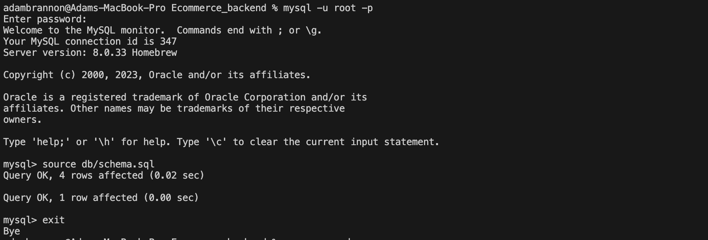
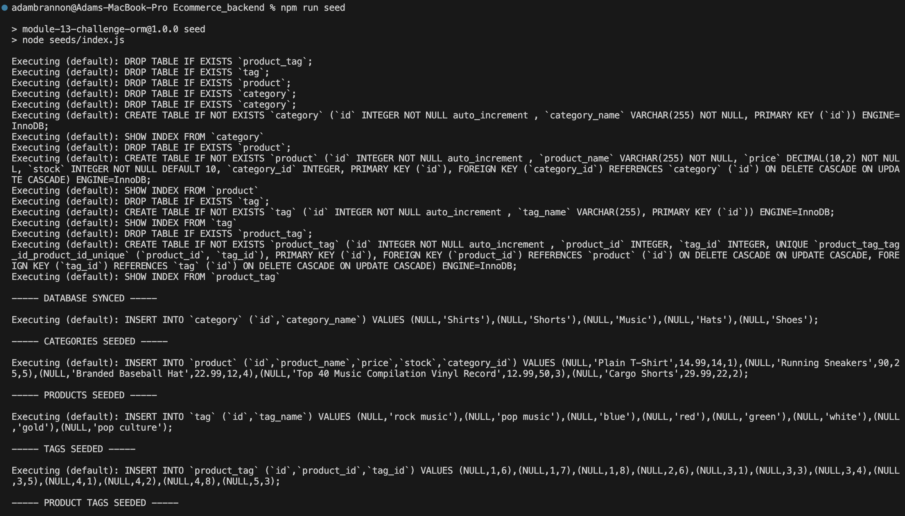
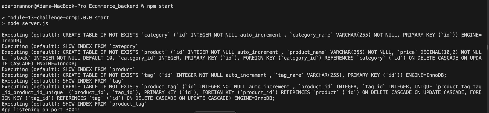
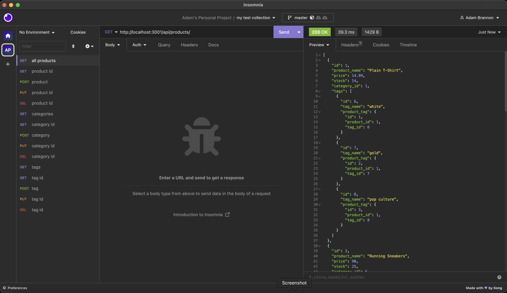

# E-commerce Backend

## Description
This app is the backend framework of a fictional E-commmerce site. It uses Express.js API and Sequelize to interact with a MySQL database. The database contains products, categories, tags, and product tags. The user can perform CRUD operations on the database using API routes.

## Quick Links

- [Installation](#installation)
  
- [Usage](#usage)

- [Technologies](#technologies)

- [Demo](#demo)
  
- [Contributors](#contributors)
  
- [Feedback and Support](#feedback-and-support)
  
- [License](#license)

## Installation

To install this application, please follow the below instructions:
- Pull the repository files to your local machine
- Open the repository in your code editor of choice
- Open the terminal and run the command `npm install` to install the required dependencies

## Usage

- Inside the terminal open the mysql shell and run the command `source db/schema.sql` to create the database
- Exit the mysql shell and in the terminal run the command `npm run seed` to seed the database
- Next run the command `npm start` to start the server and run the application
- Open an API testing application such as [Insomnia Core](https://insomnia.rest/download) or [Postman](https://www.postman.com/) to test the routes
- Get Routes:
    - `/api/products/` to view all products.
    - `/api/categories/` to view all categories.
    - `/api/tags/ `to view all tags.
    - `/api/products/<id number here>` to get a specific product based on id.
    - `/api/categories/<id number here>` to get a specific category based on id.
    - `/api/tags/<id number here> `to get a specific tag based on id.
- Post Routes:
    - `/api/products/` to create a new product.
    - `/api/categories/` to create a new category.
    - `/api/tags/ `to create a new tag.
- Put and Delete Routes:
    - `/api/products/<id number here>` to update or delete product based on id.
    - `/api/categories/<id number here>` to update or delete category based on id.
    - `/api/tags/<id number here> `to update or delete tag based on id.

## Technologies

  

          

          
          

## Demo

[Check Out the Video Demo!](https://drive.google.com/file/d/1fmZiwI-jITu65Ay0VGMEqwTLFsgARwlw/view)

## Contributors
Adam Brannon

[Check out my repo](https://github.com/adam-brannon09)

[Email Me](mailto:adam.brannon09@icloud.com)

## Feedback and Support

If you encounter any issues while using the E-commerce Backend or have any suggestions for improvement, please [open an issue](https://github.com/adam-brannon09/readme_generator/issues) on the GitHub repository. I appreciate your feedback and will address any concerns as soon as possible.

## License

The E-commerce Backend is released under the [MIT License](https://opensource.org/licenses/MIT). You are free to use, modify, and distribute this application as per the terms of this license.

    

